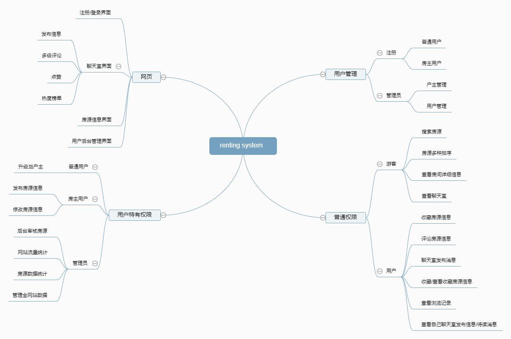
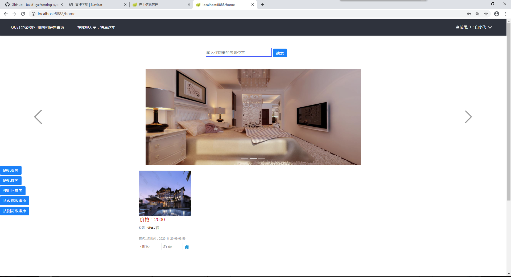
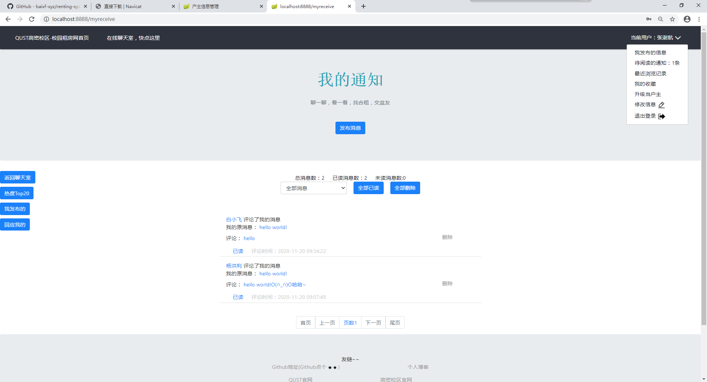
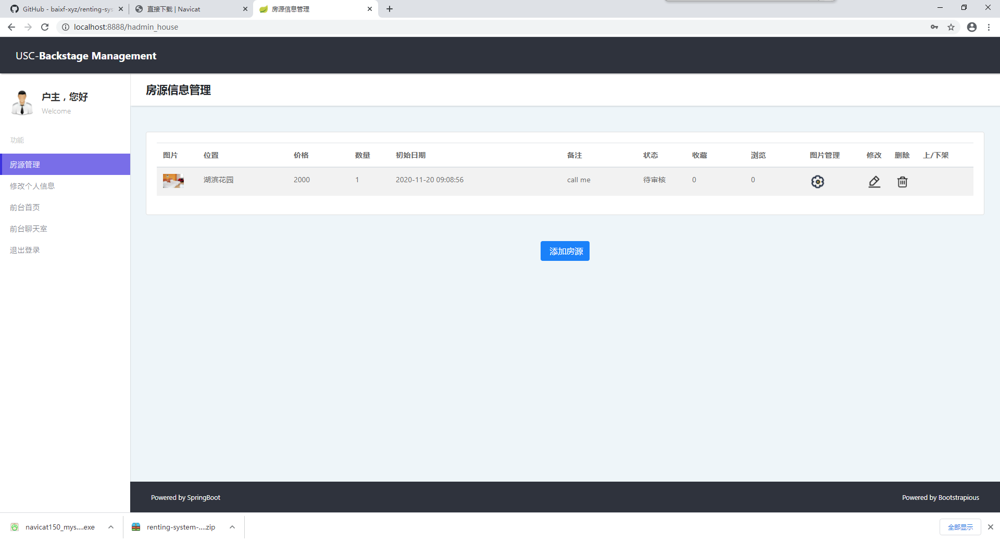
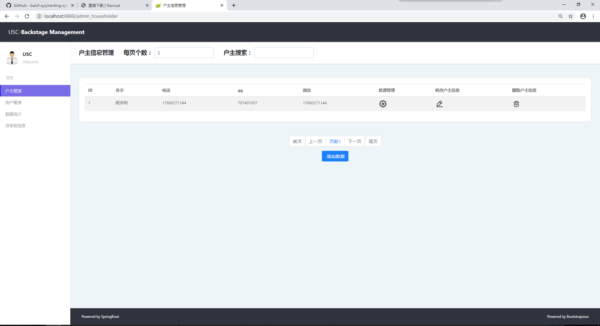
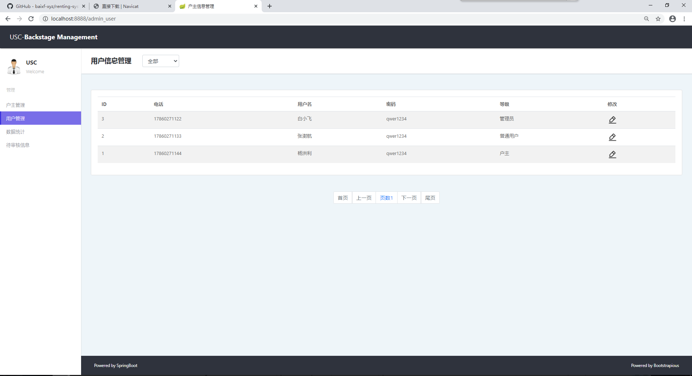
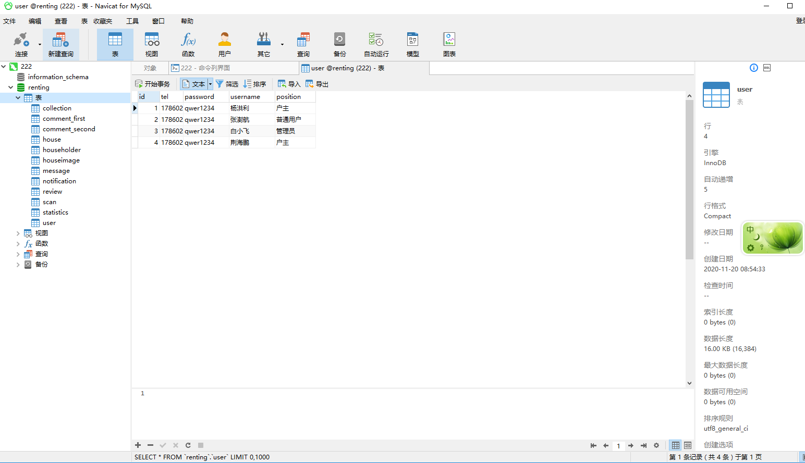

# renting system

登陆地址：localhost:8888

团队名称：rm小队

团队成员：荆海鹏 杨洪利 马允新 张澍航

### 基本功能：

##### 技术栈：

* 后端：Spring Boot 
* 前端：Vue.js 
* 中间件：Redis + Elasticsearch + Shiro + Nginx 
* 数据库：Mysql

##### 项目介绍：

* 普通用户与管理员，实现了部分核心功能 
* 户主权限，户主可以自己申请上传房源以及图片   
* 聊天室，用户可以发布信息，多级评论，点赞，查看自己发布的信息，热度榜单    
* 用户接收消息，查看消息，可以将消息标记为已读或者直接删除  
* 用户浏览足迹，收藏房源  
* 首页房源多种排序    
* 后台审核房源  
* 网站流量统计，房源各项数据统计  
* 后台查看全网站数据

## 运行截图：

